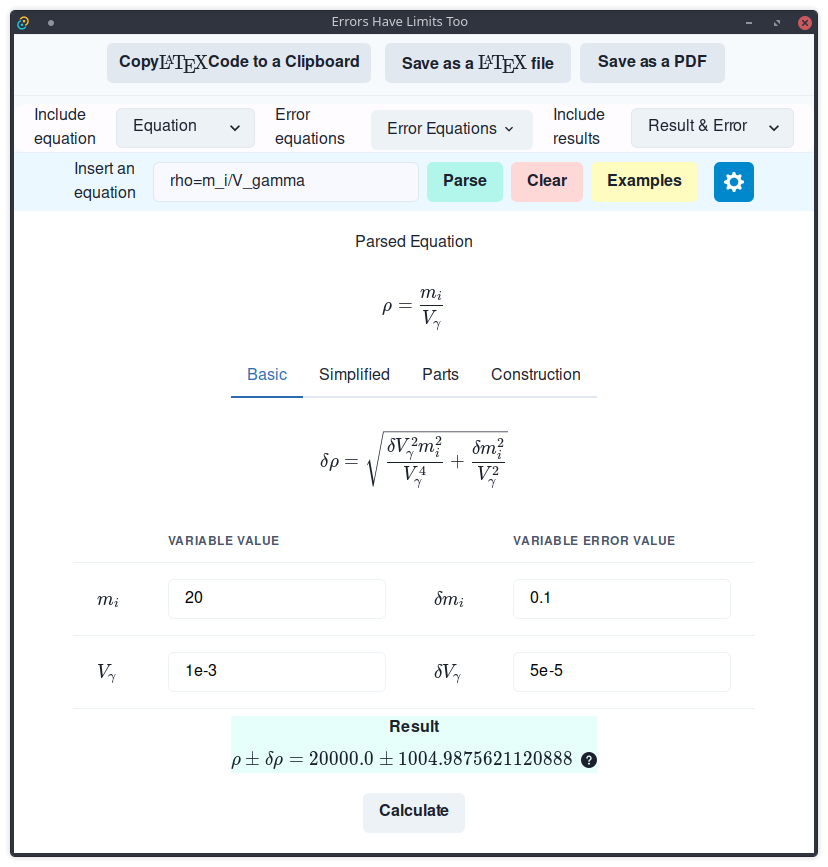
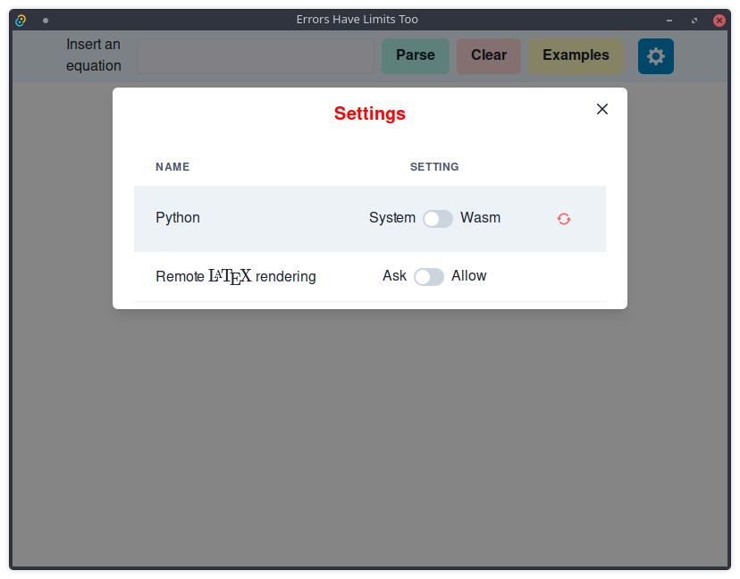

# Introduction

This is a GUI tool to estimate error propagation.  It is a Tauri app written mainly in React-typescript, Python and Nim  with minimal Rust. 

# Install

## Easy way

Just install compiled packages.

### Loading takes too much time (like 10 seconds). I want to use system Python instead of WASM/Pyodide

Python installation with sympy should be enough. Note that `libpython` should be available too.

```
pip install sympy
```

App should load system Python if you switch to system Python in Settings (may require restart depending on your system at the time this app was launched).

### I want to use system LaTeX

PDF export defaults to system in every case. Remote rendering may not be avail all the time. Install `XeTeX` and with `amsmath` packages according to your OS. `XeLaTeX` should be  available  in your `Path`.

### Copy the selected equation as an image to a clipboard

Works only in Linux or in a system that supports `wl-clipboard` or `xclip` with minor code changes. If you use Wayland install `wl-copy` provided by `wl-clipboard` or in case of X11 install `xclip`.

### I have problems

Launch this app using commandline. It may tell something important.

## I want to suffer and compile everything

OK.  You'll need to clone this repository. You'll also need `npm` https://nodejs.org/en/, `rust` https://www.rust-lang.org/tools/install and  `nim` https://nim-lang.org/. 

Install `npm` and run in this project's root

```sh
npm i
```

Nim's Nimble package manager

```sh
nimble install https://github.com/jiiihpeeh/pixie supersnappy jsony nimpy ws
```

Note that this app utilizes a modified pixie version.

Compile `callnim.nim` in `src-tauri`

```shell
nim c -d:release --app:staticLib --gc:boehm  --noMain -d:ssl callnim.nim
```

Run it in development mode

```shell
npm run tauri dev
```

In order to update changes  in compiled nim code you should make something like insignificant whitespace changes to `main.rs`  during your programming session and save that file.

You should be ready to compile this app

```sh
npm run tauri build
```

Congrats?

## Screenshots





